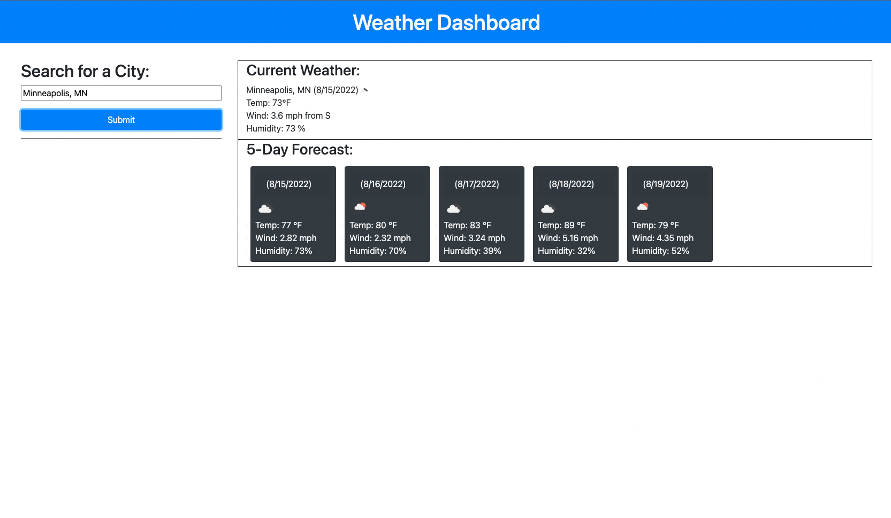

# Weather-Forecast

# Description 
This program is a weather dashboard that shows you key weather metrics to help plan your day. The dashboard takes in a city and out puts current weather data along with 5 day forecasted weather data. In this program we use javascript, css, html. We also use third party api such as jquery, bootstrap, and moment.js. We are also using the openweathermap server-side api to get our weather data. 

# Screenshot

This is what the program should look like :

# Link

Open this link in your browser to use the weather dashboard: [Weather Dashboard Link](https://cooper2016.github.io/Weather-Forecast/)